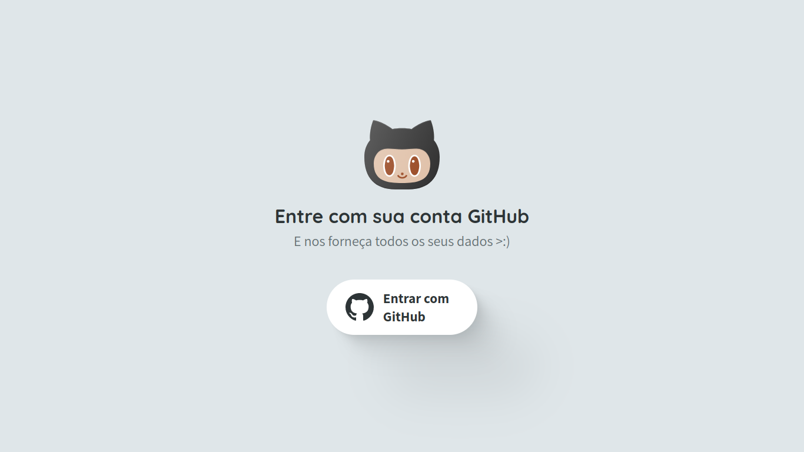
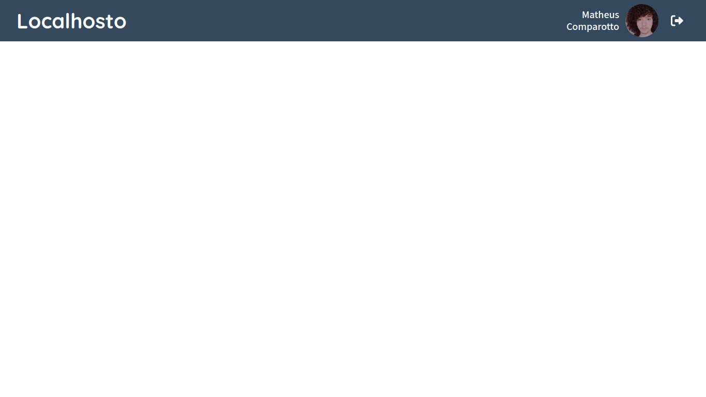

# localhosto

## Sumário

- [localhosto](#localhosto)
  - [Sumário](#sumário)
  - [Motivação](#motivação)
  - [Pilha de tecnologia](#pilha-de-tecnologia)
  - [Galeria](#galeria)
  - [Como rodar](#como-rodar)
    - [Pré-requisitos](#pré-requisitos)
    - [Passo a passo](#passo-a-passo)
    - [Criando seu próprio app Firebase (opcional)](#criando-seu-próprio-app-firebase-opcional)

## Motivação

Este app foi criado durante uma aula expositiva sobre provedores de autenticação e consiste apenas em duas telas simples: a tela para entrar com uma conta GitHub e a tela com o nome e a foto de perfil do usuário em questão. A atividade em si foi uma preparação para a [avaliação final](https://github.com/mdccg/enhanced-tv-search/) da unidade curricular.

Este foi o sexto repositório de código apresentado no [Curso Superior de TSI do IFMS](https://www.ifms.edu.br/campi/campus-aquidauana/cursos/graduacao/sistemas-para-internet/sistemas-para-internet) como requisito para obtenção da nota parcial das atividades da unidade curricular Construção de Páginas Web II.

## Pilha de tecnologia

As seguintes tecnologias foram utilizadas para desenvolver este app:

| Papel | Tecnologia |
|-|-|
| Ambiente de execução | [Node](https://nodejs.org/en/) |
| Linguagem de programação | [TypeScript](https://www.typescriptlang.org/) |
| Ambiente de desenvolvimento | [Vite](https://vitejs.dev/) |
| Autenticação | [Firebase](https://firebase.google.com/?hl=pt)|

Os créditos pelas mídias utilizadas estão disponíveis [aqui](./assets/README.md).

## Galeria




## Como rodar

### Pré-requisitos

- [Node](https://nodejs.org/en/download/);
- [Yarn](https://yarnpkg.com/) (opcional);
- Conta no [Firebase](https://firebase.google.com/?hl=pt) (opcional).

### Passo a passo

1. Clone o repositório de código em sua máquina;
   
2. Abra um shell de comando de sua preferência (prompt de comando, PowerShell, terminal _etc_.);

3. Instale as dependências do projeto através do seguinte comando:

```console
$ npm install
```

Caso esteja utilizando o gerenciador de pacotes Yarn, execute o seguinte comando como alternativa:

```console
$ yarn
```

4. Finalmente, execute o seguinte comando para iniciar o app:

Para npm:

```console
$ npm run dev
```

Para Yarn:

```console
$ yarn dev
```

### Criando seu próprio app Firebase (opcional)

Eventualmente, as [credenciais](./src/config/firebase.ts) responsáveis pela autenticação neste app podem se tornar inválidas. Neste caso, estes são passos adicionais para criar o seu próprio app Firebase e gerenciar as contas cadastradas. Caso você já tenha o app, pule para a etapa de &numero; 5. Eis o passo a passo:

1. Crie uma conta na plataforma [Firebase](https://firebase.google.com/?hl=pt);

2. Acesse o [console](https://console.firebase.google.com/) do Firebase e crie um novo projeto clicando em "Adicionar projeto";

Observação: Não é necessário ativar o Google Analytics para o seu projeto.

3. Feito isso, adicione um novo app Firebase para web clicando em `</>`;

Observação: Neste caso, não é necessário configurar o Firebase Hosting para este app, a menos que queira disponibilizá-lo na internet.

4. Feito isso, a próxima etapa "Adicionar o SDK do Firebase" te exibirá um código com as credenciais na constante `firebaseConfig`. Copie esta constante e a substitua no arquivo [`firebase.ts`](./src/config/firebase.ts);

5. Caso você já tenha um app criado e precise apenas das credenciais, vá para a página inicial do seu projeto e clique em , abaixo do título do projeto, para listar todos os apps do seu projeto;

6. Feito isso, clique em  ao lado do nome do app desejado para abrir as suas respectivas configurações;

7. No final da página, na seção "Configuração do SDK", você encontrará a mesma constante com as credenciais configuradas. Portanto, basta voltar à etapa de &numero; 4.